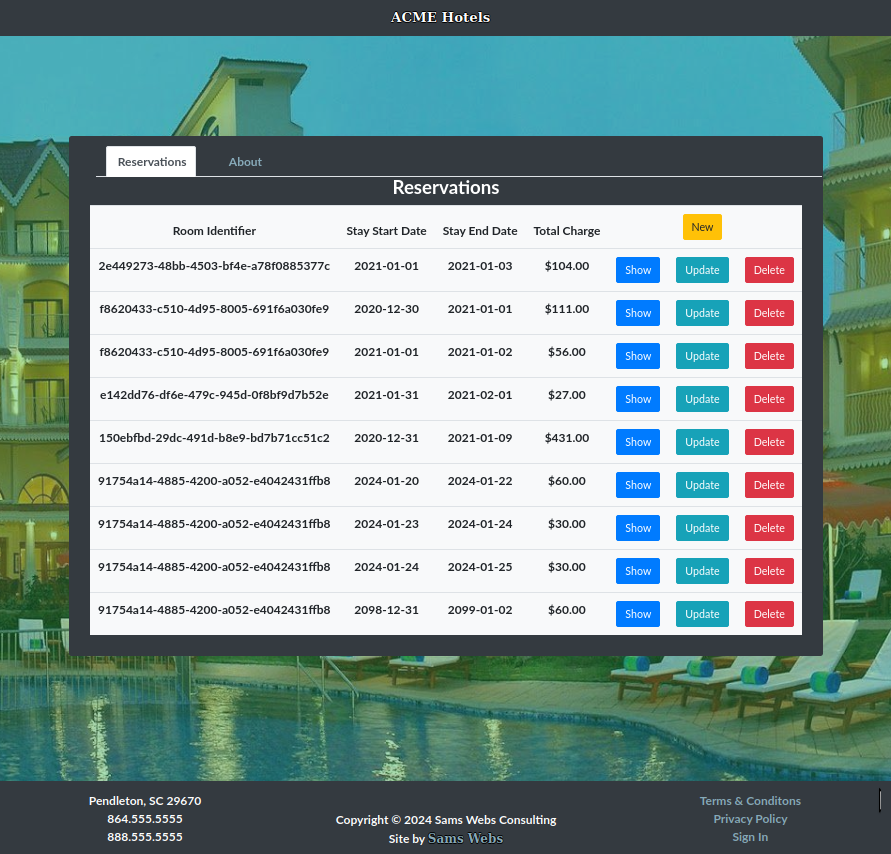

# Hotel Reservation React + Redux Sagas Example - TypeScript/Python

**TypeScript, Vite, Reactjs, Redux Toolkit, Redux Sagas, Python, FastAPI, GraphQL, AsyncPG, Postgres**

[](https://github.com/WillSams/eexample-ts-react-with-python/actions/workflows/pr-validate.yml)

This example contains a frontend and backend:

- The frontend is a [React](https://react.dev) application using [Bootstrap4](https://getbootstrap.com/docs/4.6/getting-started/introduction/) for view designs.
- The backend is a [GraphQL API](https://graphql.org) providing the ability to create, delete, and list reservatios plus available rooms for a given date range.

React [JavaScript](https://github.com/WillSams/example-js-react-with-python) and [Express MVC](https://github.com/WillSams/example-mvc-expressjs-with-python) versions of this same idea are available.

**Context**:

* When a room is reserved, it cannot be reserved by another guest on overlapping dates.
* Whenever there are multiple available rooms for a request, the room with the lower final price is assigned.
* Whenever a request is made for a single room, a double bed room may be assigned (if no single is available?).
* Smokers are not placed in non-smoking rooms.
* Non-smokers are not placed in allowed smoking rooms.
* Final price for reservations are determined by daily price * num of days requested, plus the cleaning fee.

**Web UI Usage**:



**API Usage**:

Example usage via [curl](https://curl.se/download.html):

```bash
# First, grab an access token provided by the API
ACCESS_TOKEN=$(curl -s -X POST \
  -H 'accept: application/json' \
  -H 'Content-Type: application/x-www-form-urlencoded' \
  -d 'grant_type=password&username=example-user&password=example-user' \
  "http://localhost:$RESERVATION_PORT/development/token" | jq -r '.access_token')

# List all existing booked reservations
curl http://localhost:$RESERVATION_PORT/development/graphql \
    -H 'Content-Type: application/json' \
    -H "Authorization: Bearer ${ACCESS_TOKEN}" \
    -d '{"query": "query { getAllReservations { reservations { room_id checkin_date checkout_date  } } }"}'

# Create a new reservation
# Note: if there is an overlap, you'll see a 
#   'Reservation dates overlap with an existing reservation' error message
# To see the aforementioned error, run this mutation a multiple times
curl http://localhost:$RESERVATION_PORT/development/graphql \
    -H 'Content-Type: application/json' \
    -H "Authorization: Bearer ${ACCESS_TOKEN}" \
    -d '{ "query": "mutation { createReservation( input: { room_id: \"91754a14-4885-4200-a052-e4042431ffb8\", checkin_date: \"2023-12-31\", checkout_date: \"2024-01-02\"  }) { success errors reservation { id room_id checkin_date checkout_date total_charge } } }" }'

# List Available Rooms for a given date range
curl http://localhost:$RESERVATION_PORT/development/graphql \
    -H 'Content-Type: application/json' \
    -H "Authorization: Bearer ${ACCESS_TOKEN}" \
    -d '{"query": "query { getAvailableRooms( input: { checkin_date: \"2023-12-31\", checkout_date: \"2024-01-02\" }) { success errors rooms { id num_beds allow_smoking daily_rate cleaning_fee } } }" }'
```

**Open API UI Usage**:

Navigate to [http://localhost:$RESERVATION_PORT/docs](http://localhost:$RESERVATION_PORT/docs).


## Pre-requisites

To run the service, you will need to install the following tools.

* [NodeJS](https://nodejs.org/en/)
* [Docker](https://www.docker.com/)

The below are optional but highly recommended:

* [nvm](https://github.com/nvm-sh/nvm) - Used to manage NodeJS versions.
* [Direnv](https://direnv.net/) - Used to manage environment variables.
- Install [direnv](https://direnv.net) for persisting environment variables needed for development.

## Getting Started

First, we'll need to set up our environment variables.  You can do this by either any of the methods mentioned in [/tools/ENV.md](./tools/ENV.md) but I recommend using [Direnv](https://direnv.net/).

### Install Python Packages

Execute the following in your terminal:

```bash
python -m venv venv
source venv/bin/activate
pip install --upgrade pip 
pip install -r requirements.txt
```

### Install Node.js Packages

Execute the following within your terminal:

```bash
nvm use                  # To eliminate any issues, install/use the version listed in .nvmrc. 
npm i                    # install the packages needed for project
cd ../frontend && npm i  # install the packages needed for the frontend
cd ../db && npm i        # install the packages needed for database migrations
cd ..                    # navigate back to the root of the repostiory
```

### Create the database

Finally, let's create and seed the databases and our Reservations and Rooms tables:

```bash
# Create the databases and seed them
NODE_ENV=development | npm run refresh && npm run seed
```

During development, you can just execute `npm run dev:db-baseline` to refresh the database back to the original seed data.

## Development

To run both the frontend and backend concurrently:

```bash
docker-compose up -d  # runs the database in the background
npm run dev
```

Also, you just execute the backend via `npm run dev:backend`.  to verify the backend is working:

```bash
curl http://localhost:$RESERVATION_PORT/$ENV/about
```

You can also acces the Ariadne GraphiQL (interactive test playground) instance at [http://localhost:$RESERVATION_PORT/$ENV/graphql](http://localhost:$PLAYGROUND_PORT/$ENV/graphql).  

## Testing

Both the backend and frontend utilizes [Jest](https://jestjs.io/).  To run these tests, simply execute `npm run test:frontend` or `npm run test:backend`.

## Containerization

### Building the Backend Container

```bash
docker build backend/. -t acme-hotel-example-backend:latest \
    --build-arg RESERVATION_PORT="80" \
    --build-arg ENV="${ENV}" \
    --build-arg IS_DEBUG="${IS_DEBUG}" \
    --build-arg SECRET_KEY="$SECRET_KEY" \
    --build-arg REFRESH_SECRET_KEY="$REFRESH_SECRET_KEY" \
    --build-arg PG_URL="$PG_URL"

# finally, to run a named container
docker run --name backend-dev -p 8000:80 acme-hotel-example-backend
```

To verify the environment variables set, you can execute the following on the named container by:

```bash
CONTAINER_ID=$(docker ps -qf "name=backend-dev" -n 1)

# this will display the container's environment variables in console
docker exec $CONTAINER_ID printenv   
```

If you need to re-create the container with the same name, do **docker rm <container-name>** (i.e., backend-dev) first.

### Building the Frontend Container

```bash
docker build frontend/. -t acme-hotel-example-frontend:latest \
    --build-arg FRONTEND_PORT="80" \
    --build-arg NODE_ENV=${NODE_ENV}

# finally, to run a named container
docker run --name frontend-dev -p 3000:80 acme-hotel-example-frontend
```

To verify, follow similar steps also explained in the above [Building the Backend Container](#building-the-backend-container) section.
